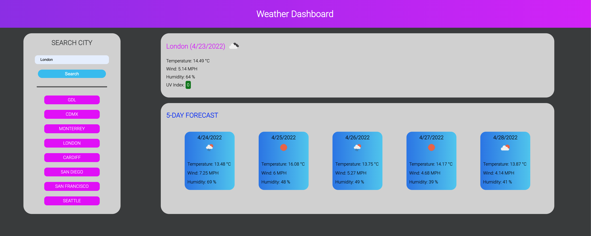
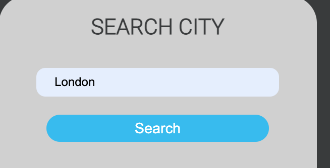
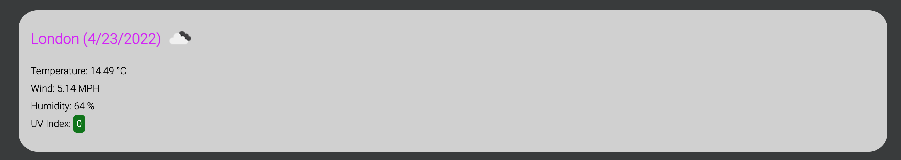
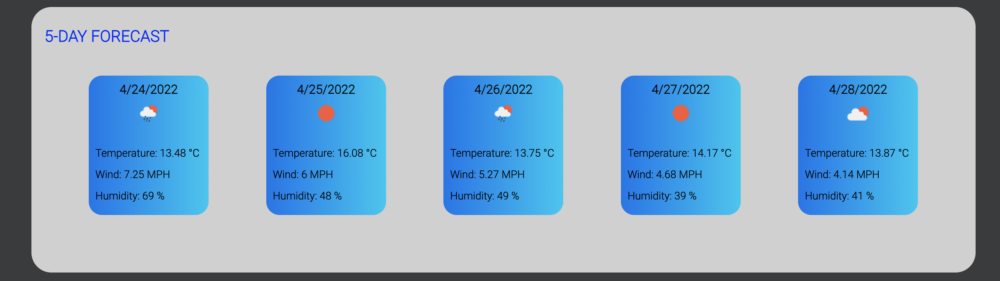
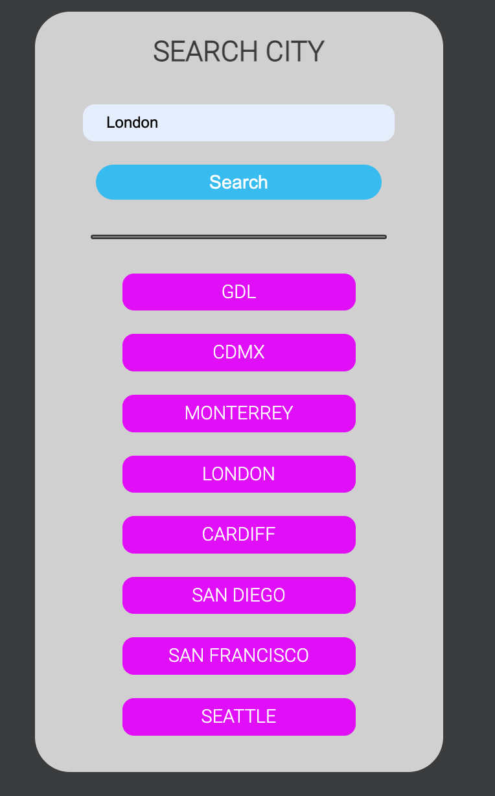

# **Adrian Strozzi - Weather Dashboard**

## Description

> Welcome to the Weather Dashboard! Search a city and get Current Weather data and 5 Day Forecast. Also your last searched cities get saved in a list a become available for quick searches.

## How to use

Use this **link** to access the Weather Dashboard: [Adrian Strozzi - Weather Dashboard](https://adrianstrozzi.github.io/Tec06WeatherDashboard/)

## Usage

Below is an image of all the elements in the Weather Dashboard:

You can use the **Search Input & Search Button** to get weather information for the specified city:

Get current weather data in the **City Info** section:

Get 5-Day Forecast weather data in the **5-Day Forecast** section:

Last searched cities get saved in the **Recent Searchs** and become available for quick access by just clicking on them:

## Credits

**Adrian Strozzi:** [https://github.com/adrianstrozzi](https://github.com/adrianstrozzi)

## License

**© 2022 Adrian Strozzi**
